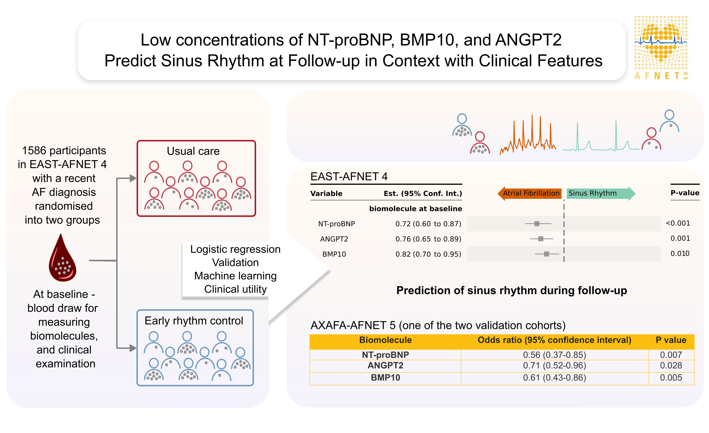

# Biomarker-based prediction of sinus rhythm in atrial fibrillation patients: the EAST-AFNET 4 biomolecule study

> Larissa Fabritz, Christoph Al-Taie, Katrin Borof, Günter Breithardt, A John Camm, Harry J G M Crijns, Victor Roth Cardoso, Winnie Chua, Silke van Elferen , Lars Eckardt, Georgios Gkoutos, Andreas Goette, Eduard Guasch, Stéphane Hatem, Andreas Metzner, Lluís Mont, Vaishnavi Ameya Murukutla, Julius Obergassel, Andreas Rillig, Moritz F Sinner, Renate B Schnabel, Ulrich Schotten, Laura C Sommerfeld, Ursula-Henrike Wienhues-Thelen, Antonia Zapf, Tanja Zeller, Paulus Kirchhof

> European Heart Journal, Volume 45, Issue 47, 14 December 2024, Pages 5002–5019, [https://doi.org/10.1093/eurheartj/ehae611](https://doi.org/10.1093/eurheartj/ehae611)

 

## Prerequisities

We assume that an R interpretater is installed on your machine and you are familiar with R, R Markdown and packages related to this work.

### Setting Up the Environment

To set up the environment, we provide an `environment.yml` file.

### Data

We do not provide data with this code repository. The analysis code can be utilized to analyze own data and / or parts of the [EAST-AFNET 4 dataset can be requested upon reasonable request](https://www.nejm.org/doi/suppl/10.1056/NEJMoa2019422/suppl_file/nejmoa2019422_data-sharing.pdf).

### Data Preprocessing

Data was preprocessed as follows:
- Log-transformation of biomarkers variables
- 1% upper winsorization of biomarker variables

## Analysis Code Snippets

Analysis code is provided in for Q markdown (qmd) files, containing the relevant snippets to reproduce the analysis and / or transfer it on further applications.

1. **EAST_SINUS_MAIN_ANALYSIS.qmd**: Main analysis for all endpoints, including table one, clinical utility's confusion matrix, reclassification and validation in TRUST-BBC dataset(s)

2. **EAST_SINUS_CUT_OFFS.qmd**: Definition of the optimal cut-off points for three biomarkers

3. **EAST_SINUS_AXAFA.qmd**: Additional validation in the AXAFA dataset

4. **EAST_SINUS_RECURRENT_AF.qmd**: Additional validation via the time-to-recurrent-AF endpoints
